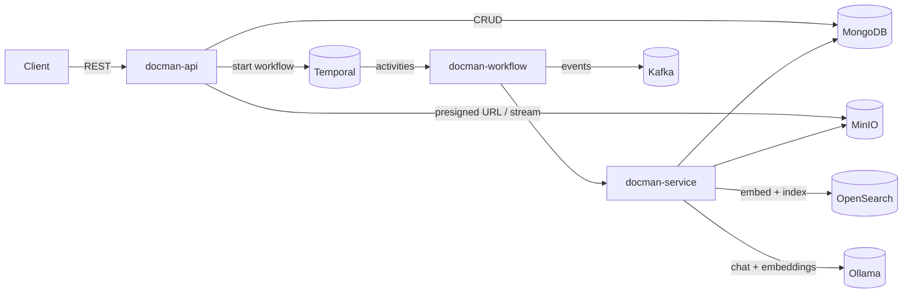
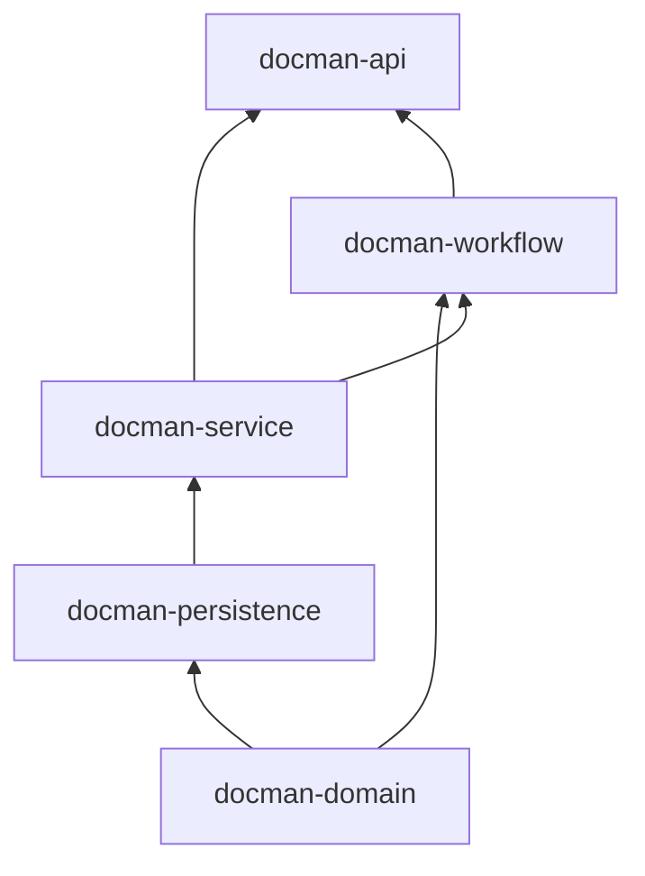
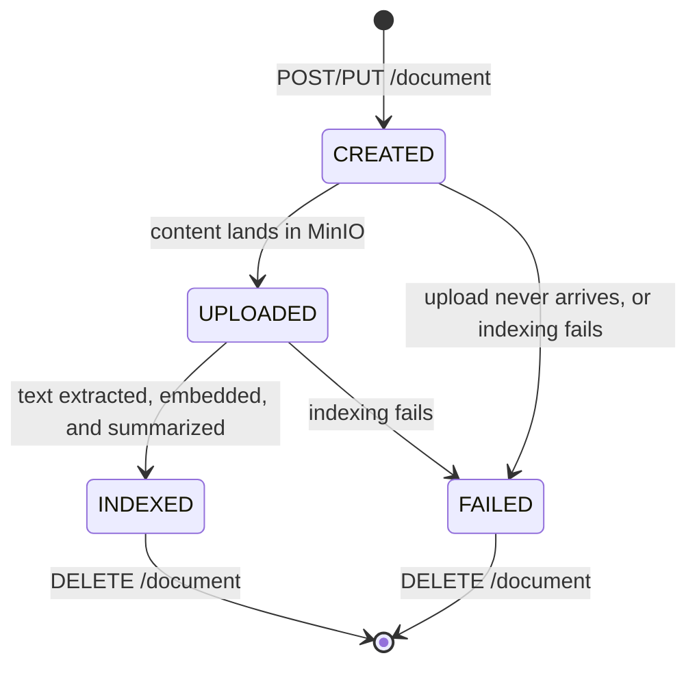
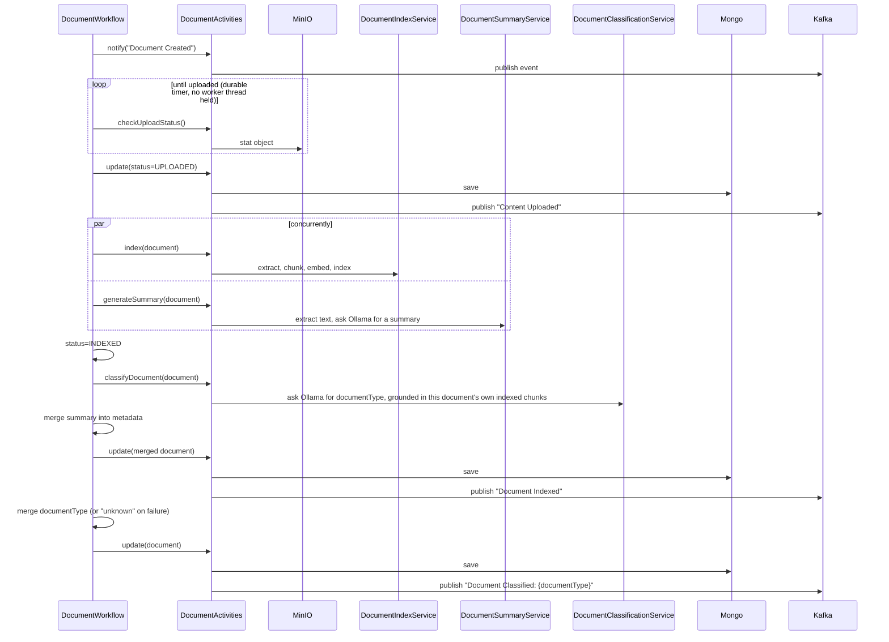

# Architecture & Tech Stack

## Overview

Docman AI ingests documents, extracts and indexes their content for retrieval, and answers
questions about them. The core design principle is that **ingestion is asynchronous**: a client
upload only has to wait for a presigned URL or a fast content write — everything expensive (text
extraction, embedding, summarization) happens afterward in a Temporal workflow, off the request
path.

## Tech Stack

| Component            | Technology                       | Role                                                                 |
|-----------------------|-----------------------------------|-----------------------------------------------------------------------|
| API / bootstrap        | Spring Boot 3.5, Java 21          | REST layer, application wiring, configuration                        |
| Object storage          | MinIO                             | Raw document bytes, accessed via presigned or server-mediated uploads |
| Metadata store           | MongoDB (Spring Data MongoDB)      | `Document` records: id, name, content type, status, document type, metadata |
| Vector store              | OpenSearch                        | Chunk embeddings + per-chunk metadata for RAG and structured search   |
| Workflow orchestration     | Temporal                          | Durable, retryable ingestion pipeline                                |
| Eventing                   | Kafka                             | Lifecycle notifications for every ingestion stage                    |
| Text extraction              | Apache Tika (via Spring AI)        | Extracts text from PDF/DOC/TXT/etc.                                  |
| Embeddings                    | Ollama `nomic-embed-text`          | 768-dimension vectors for chunked document text                      |
| Chat / summarization / RAG      | Ollama `llama3.1`                  | Answers questions (RAG) and generates document summaries             |
| Document classification         | Ollama `llama3.1` (temperature `0`) + OpenSearch | Assigns `documentType` from a fixed category set, via retrieval over the document's own indexed chunks |
| DTO ↔ entity mapping              | MapStruct                          | Generates the `Document` ⇄ `DocumentDto`/`DocumentRequest` mappers at compile time |

## Module Structure

The project is a 5-module Maven reactor. Modules depend on each other in this order (each arrow
is a compile-time Maven dependency):

| Module                | Contents                                                                                   |
|-------------------------|-----------------------------------------------------------------------------------------------|
| **docman-domain**        | The `Document` entity (Mongo-mapped), `DocumentStatus`, `DocumentType` (the fixed classification category set), all DTOs (`DocumentDto`, `DocumentRequest`, `DocumentResponse`, `DocumentSearchRequest`, `DocumentSearchResponse`), `QueryConstants`, and the MapStruct `DocumentMapper` |
| **docman-persistence**    | `DocumentMetadataRepository` — the Spring Data MongoDB repository for `Document`               |
| **docman-service**        | Service interfaces *and* implementations: `DocumentService`, `ObjectStoreService` (MinIO), `DocumentIndexService` (Tika + embeddings + OpenSearch), `DocumentSearchService` (RAG + lexical search), `DocumentSummaryService` (Ollama summarization), `DocumentClassificationService` (RAG-based `documentType` classification over the vector store) |
| **docman-workflow**        | The Temporal `DocumentWorkflow`/`DocumentActivities` definitions and implementations, and `DocumentWorkflowManager`, which starts/terminates workflows from the API layer |
| **docman-api**              | The runnable Spring Boot application: `Application` (entry point), `DocumentController` (REST), exception handling, Kafka/MinIO/executor configuration |

Only **docman-api** produces an executable artifact (a Spring Boot fat jar via
`spring-boot-maven-plugin`); the other four build plain library jars.

Note that `Document` (the Mongo entity, in `docman-domain`) never crosses the REST boundary —
the controller and all service-layer method signatures use `DocumentDto` instead. The only place
`Document` and `DocumentDto` cross paths is `DocumentMapper`, and the Temporal activity layer
(`DocumentActivitiesImpl`), which is the boundary between Temporal's serialized workflow state
(`Document`) and the DTO-based service layer.

## Document Lifecycle

A `Document` moves through these statuses (`DocumentStatus`):

`UPDATED` also exists on the enum as a generic "metadata was updated" status, used by the shared
`update()` service method independent of the ingestion pipeline.

## Ingestion Workflow

`DocumentWorkflowManager.createWorkflow` starts one `DocumentWorkflow` execution per document,
using a **deterministic workflow ID** (`doc-wf-{documentId}`) — this lets `DELETE /document` look
up and terminate the workflow for a specific document without needing to store the workflow ID
anywhere.

Key design points:

- **The upload wait is a durable timer, not a blocking activity.** `checkUploadStatus` does a
  single, fast MinIO `stat` call; the workflow itself sleeps (`Workflow.sleep`) between polls.
  This means an abandoned or slow upload doesn't tie up a Temporal worker thread — only the brief
  moment of each poll does. The workflow gives up after 15 minutes (`MAX_UPLOAD_WAIT`) if content
  never arrives, and the document ends up `FAILED`.
- **Indexing and summarization run concurrently** (`Async.function`), since both only need the
  already-uploaded content. Classification, by contrast, is kicked off only once indexing
  completes, since it queries the chunks indexing just wrote to the vector store rather than
  re-reading raw content from MinIO — see [Document Classification](#document-classification).
- **A failed summary or classification never fails the document.** Both get their own activity
  stub with a 10-minute timeout and a single attempt (retrying a slow-but-correct LLM call wastes
  time for no benefit); if either throws, the workflow logs it and continues (classification falls
  back to `unknown`) — the document still reaches `INDEXED`. A failed *index* step, by contrast,
  still fails the whole document (index/embed/search is the core capability; summarization and
  classification are supplementary).
- **Every step publishes a Kafka event** (`documents` topic) so external systems can observe
  ingestion progress without polling the API.

## Document Classification

Once indexing completes, `DocumentClassificationServiceImpl` assigns `documentType` by asking
`llama3.1` to pick exactly one of a fixed set of categories (`DocumentType`, in `docman-domain`):
`statements`, `invoices`, `policy documents`, `compliance certificates`, `insurance documents`,
`contracts` — or `unknown` if the document doesn't clearly match any of them (also the fallback if
the model's response doesn't match a known label, or if the activity throws).

Rather than re-fetching the raw file from MinIO and re-running Tika (which indexing already did),
classification reuses the chunks indexing just wrote to the OpenSearch vector store: it runs a
`QuestionAnswerAdvisor`-based RAG query scoped to this document alone, via a `parent_document_id`
filter expression (the same metadata key `DocumentIndexService.deleteIndex` uses to clean up a
document's chunks). This means classification only becomes possible after indexing — there's
nothing to retrieve before that.

Classification runs at `temperature 0` via a per-call `OllamaChatOptions` override passed directly
in code, so the same document consistently gets the same category — a single-word classification
otherwise drifts between similar categories (e.g. "invoices" vs. "statements") on repeated runs of
identical content at Ollama's non-zero default sampling temperature. (RAG answers and summaries
don't set this override, so they run at whatever temperature Ollama itself defaults to — see the
`spring.ai.ollama.chat.options.temperature` note in
[`docs/SETUP.md`](SETUP.md#configuration-reference) for a config quirk affecting that value.)

Once a category is decided, the workflow persists `documentType` on the `Document` record and
publishes a `Document Classified: {documentType}` Kafka event — separate from the `Document
Indexed` event, since classification finishes after indexing's own Mongo write.

**Known limitation**: classification updates the Mongo `Document` record, but does *not* retroactively
update the `documentType` already written into the vector store's chunk metadata (indexing runs
*before* classification, so it can only capture whatever `documentType` the caller supplied at
creation — usually nothing). This means `POST /document/search` filtering by `documentType` matches
the caller-supplied value at upload time, not the AI-assigned one; `GET /document/metadata/{id}` is
the source of truth for the classified type.

## Search & RAG

Two independent search paths exist over the same OpenSearch index (`docman-vector-index`):

- **`POST /document/ask`** — vector similarity search + RAG. The question is embedded, the most
  relevant chunks are retrieved from OpenSearch, and `llama3.1` generates an answer grounded in
  that context (`QuestionAnswerAdvisor`). Runs on a bounded background executor
  (`askExecutor`, separate from Tomcat's request threads) since Ollama inference can take minutes
  on CPU-only hardware — the HTTP request uses Spring MVC's `DeferredResult` so the calling thread
  isn't blocked for the duration.
- **`POST /document/search`** — structured metadata search. Callers supply a map of field → value
  filters (e.g. `{"documentType": "invoice"}`); the server builds an OpenSearch `bool`/`match`
  query, prefixing every key with `metadata.` server-side. This means callers can never reach
  fields outside the `metadata` subtree (like raw `content` or the `embedding` vector) no matter
  what key they supply — the query is built from a fixed field-path template, not from arbitrary
  client-supplied query syntax.

Each indexed chunk's metadata includes the caller-supplied `metadata` map, plus two fields the
system adds automatically: `parent_document_id` (used to collapse/dedupe multiple chunks from the
same document in search results) and, when set at creation time, `documentType` — see the [known
limitation](#document-classification) above for why this is the caller-supplied value, not the
later AI-classified one.

## Presigned URLs

`POST /document` returns a MinIO presigned **PUT** URL — the client uploads content directly to
object storage, and the workflow's upload-wait step picks it up once it lands. `GET
/document/content` returns a presigned **GET** URL for downloading. Both are genuinely
method-locked (the signature only validates for its intended HTTP method) and expire independently
(`minio.presigned.upload-url-expiry` / `download-url-expiry`, see
[`docs/SETUP.md`](SETUP.md#configuration-reference)).

`PUT /document` is the alternative, synchronous path: the client sends the file directly in the
request body (multipart), and the server streams it straight to MinIO without buffering the whole
file in memory.

## Error Handling

`DocmanExceptionHandler` (`docman-api`) maps exceptions to a consistent
[`ProblemDetail`](https://datatracker.ietf.org/doc/html/rfc7873) JSON body for every error path:

| Exception                     | HTTP status |
|---------------------------------|-------------|
| `DocumentNotFoundException`      | 404         |
| `DocmanException`                | 400         |
| Any other unhandled exception     | 500         |

See [`docs/API.md`](API.md) for the exact error body shape and per-endpoint status codes.
