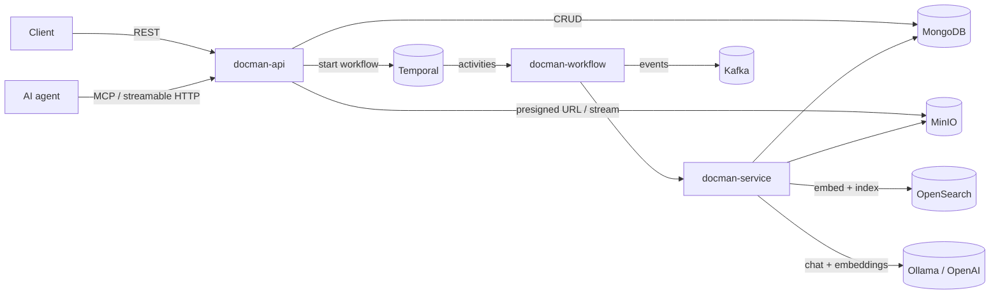
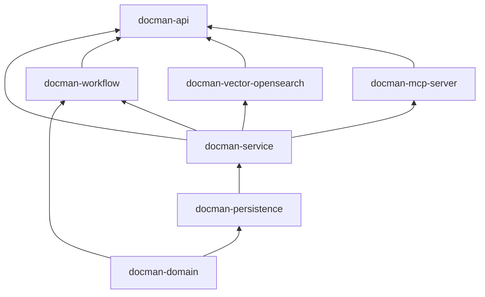
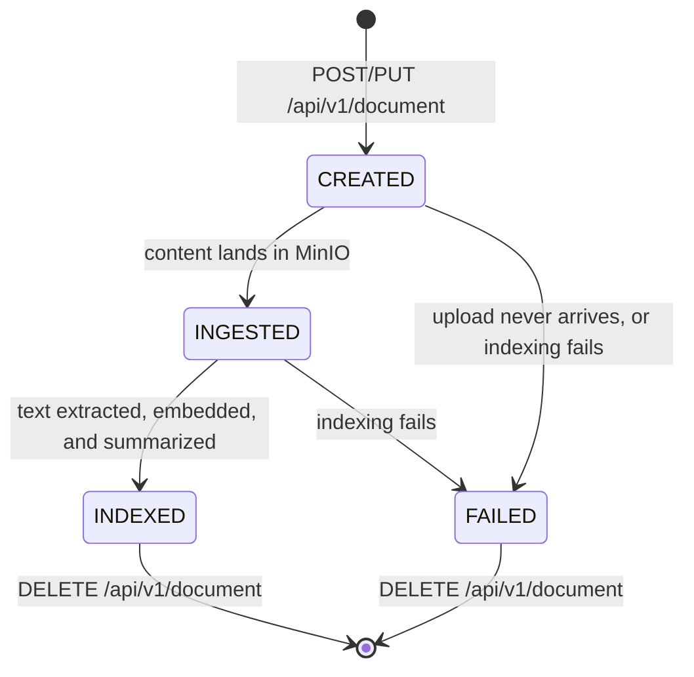
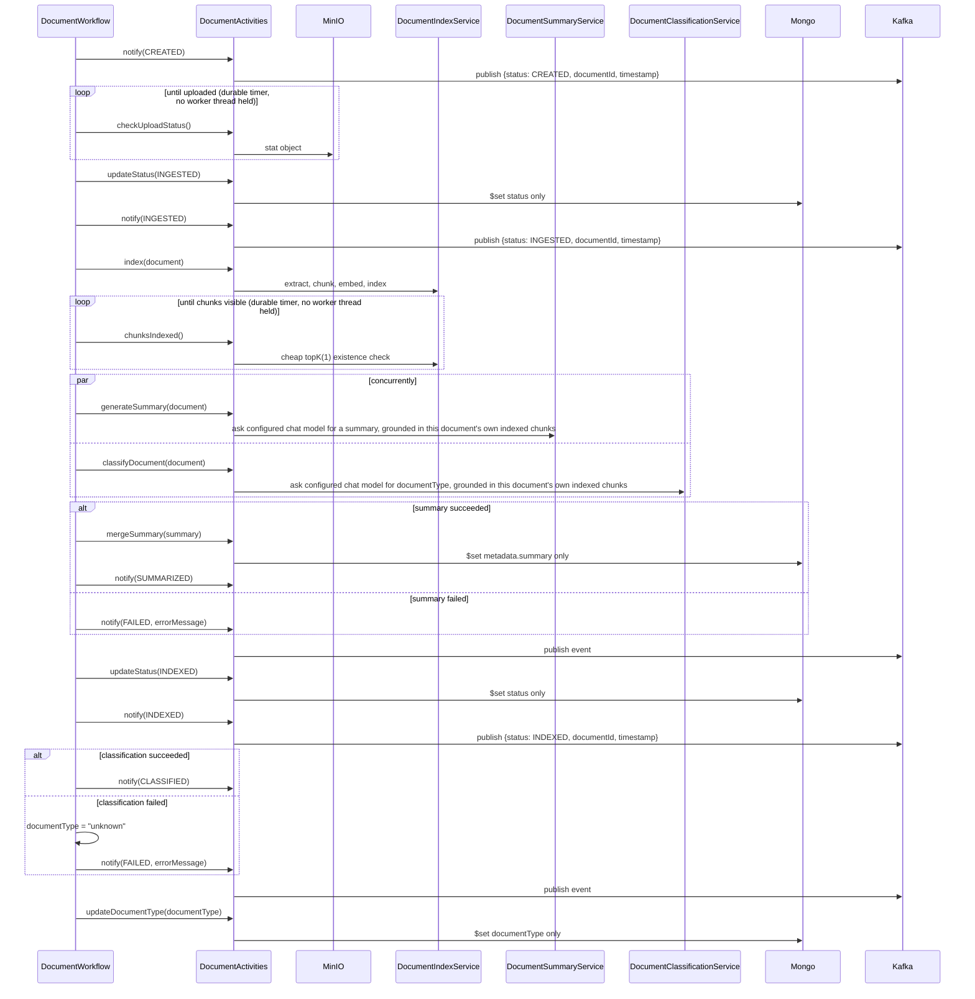

# Architecture & Tech Stack

## Overview

Docman AI ingests documents, extracts and indexes their content for retrieval, and answers
questions about them. The core design principle is that **ingestion is asynchronous**: a client
upload only has to wait for a presigned URL or a fast content write — everything expensive (text
extraction, embedding, summarization) happens afterward in a Temporal workflow, off the request
path.



`docman-api` serves both the REST API and, via the `docman-mcp-server` module, an MCP endpoint at `/mcp` on the same port — an AI agent talks to the same underlying services (`DocumentSearchService`/`DocumentService`/`ObjectStoreService`) a REST client does, just over a different protocol and a narrower, read-only surface. See [MCP Server](#mcp-server) below.

## Tech Stack

| Component            | Technology                       | Role                                                                 |
|-----------------------|-----------------------------------|-----------------------------------------------------------------------|
| API / bootstrap        | Spring Boot 3.5, Java 21          | REST layer, application wiring, configuration                        |
| Object storage          | MinIO                             | Raw document bytes, accessed via presigned or server-mediated uploads |
| Metadata store           | MongoDB (Spring Data MongoDB)      | `Document` records (id, name, content type, status, document type, metadata, audit fields, version) plus a `document_revisions` collection tracking every past version's snapshot |
| Vector store              | OpenSearch                        | Chunk embeddings + per-chunk metadata for RAG and structured search   |
| Workflow orchestration     | Temporal                          | Durable, retryable ingestion pipeline                                |
| Eventing                   | Kafka                             | JSON lifecycle notifications (`DocumentNotification`) for every ingestion stage, plus a metadata-sync trigger topic |
| Text extraction              | Apache Tika (via Spring AI)        | Extracts text from PDF/DOC/TXT/etc.                                  |
| Model provider                  | Spring AI, vendor-agnostic         | `ChatClient`/`EmbeddingModel`/`VectorStore` — swappable via `spring.ai.model.chat` / `spring.ai.model.embedding`, not code. Default profile: Ollama (`llama3.1` chat, `nomic-embed-text` embeddings, 768-dim). `prod` profile: OpenAI (`gpt-5.4-mini` chat, `text-embedding-3-small` embeddings, 1536-dim, separate index) — see [`docs/SETUP.md`](SETUP.md#configuration-reference) |
| Chat / RAG answers                | Configured chat model (`llama3.1` default / `gpt-5.4-mini` in `prod`) | Answers questions grounded in indexed document content               |
| Document summarization            | Configured chat model + OpenSearch      | Generates a 2-3 sentence summary via retrieval over the document's own indexed chunks |
| Document classification         | Configured chat model (temperature `0`) + OpenSearch | Assigns `documentType` from a fixed category set, via retrieval over the document's own indexed chunks |
| DTO ↔ entity mapping              | MapStruct                          | Generates the `Document` ⇄ `DocumentDto`/`DocumentRequest` mappers at compile time |
| Agent access                        | Spring AI MCP server (streamable HTTP) | Exposes six read-only search/retrieval tools to MCP clients at `/mcp`, on the same port as the REST API — see [MCP Server](#mcp-server) |

## Module Structure

The project is a 7-module Maven reactor. Modules depend on each other in this order (each arrow
is a compile-time Maven dependency):



| Module                | Contents                                                                                   |
|-------------------------|-----------------------------------------------------------------------------------------------|
| **docman-domain**        | The `Document` entity (Mongo-mapped, now with `createdAt`/`createdBy`/`updatedAt`/`updatedBy`/`version`), `DocumentRevision` (a per-version snapshot), `DocumentStatus`, `DocumentType` (the fixed classification category set), all DTOs (`DocumentDto`, `DocumentRequest`, `DocumentUpdateRequest`, `DocumentResponse`, `DocumentSearchRequest`, `DocumentSearchResponse`), `QueryConstants`, and the MapStruct `DocumentMapper` |
| **docman-persistence**    | `DocumentMetadataRepository` and `DocumentRevisionRepository` — the Spring Data MongoDB repositories for `Document` and `DocumentRevision`      |
| **docman-service**        | Service interfaces *and* implementations: `DocumentService` (create/update, version bumps + revision snapshots, also publishes the metadata-sync Kafka trigger), `ObjectStoreService` (version-scoped MinIO keys), `DocumentIndexService` (Tika + embeddings + OpenSearch; also the metadata-only vector store sync), `DocumentSearchService` (RAG + lexical search), `DocumentSummaryService` (RAG-based summarization over the vector store), `DocumentClassificationService` (RAG-based `documentType` classification over the vector store) |
| **docman-workflow**        | The Temporal `DocumentWorkflow`/`DocumentActivities` definitions and implementations, and `DocumentWorkflowManager`, which starts/terminates a **version-scoped** workflow execution per document version |
| **docman-vector-opensearch** | The sole implementation of `DocumentVectorStore` (`OpenSearchDocumentVectorStore`), plus the `OpenSearchClient`/OpenSearch `VectorStore` autoconfiguration — the only module with an OpenSearch dependency (see [Vector store: provider-agnostic by module boundary](#vector-store-provider-agnostic-by-module-boundary-not-just-config)) |
| **docman-mcp-server**       | `DocumentMcpTools` (six read-only `@Tool` methods over `DocumentSearchService`/`DocumentService`/`ObjectStoreService`) and `McpToolConfiguration`, plus the Spring AI MCP server starter dependency — see [MCP Server](#mcp-server) |
| **docman-api**              | The runnable Spring Boot application: `Application` (entry point), `DocumentController` (REST, including the update API and version-aware GETs), exception handling, Kafka/MinIO/executor configuration, `DocumentIndexSyncConsumer` (the metadata-sync Kafka listener) |

Only **docman-api** produces an executable artifact (a Spring Boot fat jar via
`spring-boot-maven-plugin`); the other six build plain library jars.

Note that `Document` (the Mongo entity, in `docman-domain`) never crosses the REST boundary —
the controller and all service-layer method signatures use `DocumentDto` instead. The only place
`Document` and `DocumentDto` cross paths is `DocumentMapper`, and the Temporal activity layer
(`DocumentActivitiesImpl`), which is the boundary between Temporal's serialized workflow state
(`Document`) and the DTO-based service layer.

## Document Lifecycle

A `Document`'s persisted `status` field moves through these values:



`UPDATED` also exists on the enum as a generic "metadata was updated" status, used by the shared
`update()` service method independent of the ingestion pipeline.

`DocumentStatus` has two more values, `SUMMARIZED` and `CLASSIFIED`, but they're **transient
Kafka-notification statuses only** — the workflow publishes them once the respective step
completes, but never writes them to the `Document`'s persisted `status` field (see
[Ingestion Workflow](#ingestion-workflow)). `GET /api/v1/document/metadata/{id}` will therefore
never return `SUMMARIZED` or `CLASSIFIED` as a document's `status`.

`status` and `version` are independent axes: `status` tracks where the *current* version is in
the ingestion pipeline; `version` is a monotonically increasing counter that only moves on
user-driven changes (a new file, or a metadata update via `PUT /api/v1/document/{id}`) — see
[Document Versioning & Revision History](#document-versioning--revision-history). A new file
version resets `status` back to `CREATED` and re-enters this same state machine.

## Ingestion Workflow

`DocumentWorkflowManager.createWorkflow` starts one `DocumentWorkflow` execution per document
**version**, using a **deterministic workflow ID** (`doc-wf-{documentId}-v{version}`) — this lets
`DELETE /api/v1/document/{id}` look up and terminate the current version's workflow without needing to
store the workflow ID anywhere, and lets a new file version start its own independent execution
(under a new ID) rather than depending on the previous version's run having already closed.



Key design points:

- **The upload wait is a durable timer, not a blocking activity.** `checkUploadStatus` does a
  single, fast MinIO `stat` call; the workflow itself sleeps (`Workflow.sleep`) between polls.
  This means an abandoned or slow upload doesn't tie up a Temporal worker thread — only the brief
  moment of each poll does. The workflow gives up after 15 minutes (`MAX_UPLOAD_WAIT`) if content
  never arrives, and the document ends up `FAILED`.
- **Summarization and classification both run only after indexing completes**, since both query
  the chunks indexing just wrote to the vector store rather than re-reading raw content from
  MinIO — see [Document Summarization & Classification](#document-summarization--classification).
  They run concurrently with *each other*, but neither can start until indexing has finished *and*
  the workflow's `chunksIndexed` poll (same durable-timer pattern as the upload wait) confirms the
  chunks are actually visible in OpenSearch.
- **Every workflow-driven Mongo write is a targeted `$set` on the one field it owns**
  (`updateStatus`/`mergeSummary`/`updateDocumentType`, plus the outer catch block's `updateStatus`
  on failure), never a full document replace. The `document` object the workflow carries is a
  snapshot captured once when it started; ingestion (especially the LLM calls) can run for minutes,
  during which a user-driven `PUT /api/v1/document/{id}` can concurrently bump `version` or change
  `metadata`. A full replace using the stale snapshot would silently revert those concurrent
  changes — `mergeSummary` in particular uses Mongo dot-notation (`metadata.summary`) so it adds
  the AI-generated summary without touching any other metadata key a concurrent update may have
  changed.
- **A failed summary or classification never fails the document.** Both get their own activity
  stub with a 10-minute timeout and a single attempt (retrying a slow-but-correct LLM call wastes
  time for no benefit); if either throws, the workflow logs it and continues (classification falls
  back to `unknown`) — the document still reaches `INDEXED`. A failed *index* step, by contrast,
  still fails the whole document (index/embed/search is the core capability; summarization and
  classification are supplementary).
- **Every step publishes a Kafka event** (`documents` topic) so external systems can observe
  ingestion progress without polling the API. Each event is a `DocumentNotification`
  (`docman-domain`), serialized to JSON by `DocumentActivitiesImpl.notify` and deserialized back by
  `KafkaConsumer`:

  ```json
  {
    "status": "INDEXED",
    "documentId": "a391f59e-f0fb-4d98-a36c-9f7706cebb8a",
    "timestamp": "2026-07-25T03:25:20.569049Z",
    "errorMessage": null
  }
  ```

  `status` is any `DocumentStatus` value, including the two that never reach the persisted
  `Document.status` field (`SUMMARIZED`, `CLASSIFIED` — see [Document
  Lifecycle](#document-lifecycle)). `errorMessage` is only populated when `status` is `FAILED`; a
  step's own failure (summary generation, classification) publishes `FAILED` with a message
  describing *that* step without failing the rest of the workflow, distinct from the workflow-level
  `FAILED` published from the outer catch block when the whole document fails.

## Document Versioning & Revision History

Every `Document` carries `createdAt`/`createdBy` (set once, at creation) and
`updatedAt`/`updatedBy` (touched only by user-driven changes) alongside a `version` counter that
starts at `1` and increments exactly when a `POST`/`PUT /api/v1/document/{id}` update includes a new
file, or changes metadata/documentType without one. Internal system saves — the workflow's own
status transitions, summary merge, and classification merge, all still going through the original
`DocumentService.update(DocumentDto)` — deliberately leave `version`/`updatedAt`/`updatedBy`
untouched, so the version count reflects user intent only, not every write the pipeline happens
to make along the way.

Every version bump (`DocumentServiceImpl.updateDocument`) also writes a `DocumentRevision`
snapshot to the `document_revisions` collection — `documentId`, `version`, `name`, `contentType`,
`documentType`, `metadata`, `updatedAt`, `updatedBy`, and whether this version included a new
file. `create()` writes a version-1 revision too, so history is complete from the start.
`GET /api/v1/document/metadata/{id}/{version}` reads directly from this collection instead of the live
`Document` (a revision has no `status` — that's a live-workflow concept, not part of a version
snapshot).

Updates come in the same two flavors as creation does, mirroring `POST`/`PUT /api/v1/document`:

- **`PUT /api/v1/document/{id}`** (multipart: a `metadata` part shaped like `DocumentUpdateRequest`, plus
  an optional `file` part) handles both cases directly:
  - **Metadata-only** (`documentType`/`metadata`/`updatedBy`, no file): bumps `version`, replaces
    the metadata map outright rather than merging it (an update that omits a key drops it,
    including system-added ones like `summary`, unless the caller re-supplies it — see
    [`docs/API.md`](API.md) for the confirmed rationale), and triggers the existing
    [metadata-sync](#keeping-vector-store-metadata-in-sync) Kafka event so the change reaches the
    vector store without a reindex.
  - **Metadata + file**: same version bump, plus a `name`/`contentType` change and `status`
    resetting to `CREATED`. The controller calls `DocumentIndexService.deleteIndex` to clear the
    *previous* version's chunks first — indexing always assigns fresh chunk IDs, so without this
    step old and new versions' chunks would both remain and pollute search/RAG — uploads the new
    content, then starts a new workflow execution for this version: the exact same ingestion
    pipeline as initial creation (index, summarize, classify). The metadata-sync trigger is
    deliberately skipped for this case: syncing now would be redundant (the new version's own
    indexing is about to write fresh metadata anyway), and testing showed it can race the
    concurrent `deleteIndex` call and fail with an OpenSearch version conflict on the same chunk.
- **`POST /api/v1/document/{id}`** is the presigned-upload counterpart, for when a new file version is
  intended but the caller wants to upload it directly to MinIO rather than through this API (large
  files, browser clients, etc.) — same version bump, metadata replacement, `deleteIndex` cleanup,
  and new workflow execution as the file case above, but it returns a presigned **PUT** URL instead
  of accepting the bytes, and the new workflow's upload-wait step picks up the content once the
  client uploads it (exactly like `POST /api/v1/document` on creation). Since the presigned URL needs the
  new object key upfront, this endpoint always requires `name`/`contentType` in the request body —
  unlike `PUT /api/v1/document/{id}`, it has no metadata-only mode.

**Concurrency guard**: `updateDocument` uses an optimistic-concurrency compare-and-swap rather
than a plain read-modify-write. It reads the current `Document`, then applies the change via
`MongoTemplate.findAndModify` with a query matching both `_id` *and* `version` equal to what was
just read, atomically setting the new fields (including `version + 1`) only if that match still
holds. If another request already won the race and bumped the version in between, the conditional
update matches nothing, `findAndModify` returns `null`, and the loser gets a
`DocumentConflictException` (`409 Conflict`) instead of silently overwriting or losing the winner's
change — verified under load by firing a burst of concurrent updates at the same document: exactly
one succeeds per contended version, the rest cleanly 409, and the revision history has no
duplicate or corrupted entries. This is deliberately different from the version field itself, which
is a plain int (not Spring Data's `@Version` optimistic-locking annotation, since that would bump
on every save including internal system ones) — the concurrency check here is a manual condition
on the same field, applied only in this one code path.

MinIO objects are stored per version — `{documentId}/{version}/{name}` — so every version's file
remains independently retrievable; `ObjectStoreServiceImpl` builds this key from
`DocumentDto.getVersion()` for every operation. A full `DELETE /api/v1/document/{id}` removes every
version's object (a MinIO prefix list + bulk delete under `{documentId}/`), not just the current
one, along with all of that document's `DocumentRevision`s.

`GET /api/v1/document/metadata/{id}` and `GET /api/v1/document/content/{id}` both accept an optional trailing
`/{version}` segment to look up a specific past version instead of the latest. A content lookup
for a specific version also checks MinIO object existence first and 404s if that version never
had a file uploaded (e.g. a metadata-only revision) — the "latest" path doesn't do this extra
check, matching its existing behavior.

`GET /api/v1/document/revisions/{id}` returns the entire history in one call — every
`DocumentRevision` for the id, oldest first, mapped to the same metadata-only `DocumentDto` shape
`GET /api/v1/document/metadata/{id}/{version}` uses for a single version (`status` always `null`,
content never included). It 404s when the id has no revisions at all, the same "document not
found" condition as the other lookups.

## Soft Delete

`Document.deleted` (boolean, default `false`) is a second, non-destructive deletion mechanism
alongside the hard `DELETE /api/v1/document/{id}` described above. `DELETE
/api/v1/document/{id}/soft` (`DocumentController.softDelete` → `DocumentServiceImpl.softDelete`)
only flips this one field via a targeted Mongo update (`applyUpdate`, the same helper
`updateStatus` uses) — the Mongo record, its full `DocumentRevision` history, and every version's
MinIO content are all left untouched. Nothing about the ingestion pipeline or `DocumentStatus`
changes either; `deleted` is a completely independent axis from `status`/`version`.

The visible effect of a soft delete is entirely on the search side: once the flag is set, the
document stops appearing in `/ask`, `/search`, and `/search/hybrid` results (see [Search &
RAG](#search--rag)). That happens by riding the exact same mechanism as [Keeping Vector Store
Metadata in Sync](#keeping-vector-store-metadata-in-sync) — `softDelete` publishes to the
`document-metadata-sync` Kafka topic just like `mergeSummary`/`updateDocumentType`/`updateDocument`
do, `DocumentIndexSyncConsumer` picks it up, and `DocumentIndexService.updateMetadata` merges the
current `deleted` value into every one of the document's indexed chunks. There's no separate
code path for the delete case; soft delete works by making sure `deleted` is one of the fields that
sync keeps current, and making sure every search path filters on it.

One consequence follows directly from reusing that mechanism: the exclusion is **asynchronous**,
with the same eventual-consistency window as any other metadata sync (typically milliseconds to a
couple of seconds locally) — a search issued immediately after `DELETE .../soft` returns `204` can
still briefly include the document, and symmetrically, a search issued right after `POST
.../restore` can briefly still exclude it.

`POST /api/v1/document/{id}/restore` (`DocumentController.restore` → `DocumentServiceImpl.restore`)
reverses a soft delete: the same targeted Mongo update as `softDelete`, just setting `deleted` back
to `false`, followed by the same publish to `document-metadata-sync` so the cleared flag propagates
to the indexed chunks the same way. Unlike `softDelete` (`204 No Content`), it returns `200` with
the updated `DocumentDto` — there's no other state change to report back, so echoing the document
confirms `deleted` actually flipped. Restoring a document that's already not soft-deleted is a
harmless no-op (`applyUpdate` still succeeds, `deleted` was already `false`).

`Document.authorisation` (nullable `String`) is a related, currently-inert field on the same model
— reserved for a future document-level access-control code, but nothing reads or enforces it yet.

## Document Summarization & Classification

Once indexing completes, two independent AI steps run concurrently, both grounded in the chunks
indexing just wrote to the OpenSearch vector store rather than re-fetching the raw file from MinIO
and re-running Tika a second time:

- **`DocumentSummaryServiceImpl`** retrieves this document's own chunks (a `parent_document_id`
  filter, the same metadata key `DocumentIndexService.deleteIndex` uses to clean them up, with a
  generous `topK` so the filter — not similarity ranking — is what bounds the result set), sorts
  them back into original reading order using their `chunk_index` metadata (vector search returns
  chunks in similarity order, not document order), reassembles the text, and asks the configured
  chat model (`llama3.1` by default, `gpt-5.4-mini` in `prod` — see below) for a 2-3 sentence
  summary. If no chunks come back (e.g. the file had no extractable text), it returns `null` and the
  workflow skips the summary rather than storing a hallucinated one.
- **`DocumentClassificationServiceImpl`** runs a `QuestionAnswerAdvisor`-based RAG query scoped the
  same way, asking the configured chat model to pick exactly one of a fixed set of categories
  (`DocumentType`, in `docman-domain`): `statements`, `invoices`, `policyDocuments`,
  `complianceCertificates`, `insuranceDocuments`, `contracts` — or `unknown` if the document doesn't
  clearly match any of them (also the fallback if the model's response doesn't match a known label,
  or if the activity throws). It runs at `temperature 0` (unlike the `1` used for RAG answers and
  summaries, configured via `spring.ai.<ollama|openai>.chat.options.temperature` in
  `application*.yaml`) via a per-call portable `ChatOptions` override passed directly in code — not
  a provider-specific options class, so this works unchanged regardless of which model provider is
  active — so the same document consistently gets the same category — a single-word classification
  otherwise drifts between similar categories (e.g. "invoices" vs. "statements") on repeated runs of
  identical content at the app's configured temperature of `1`.

Both prompts (and `/ask`'s) apply the same basic [prompt-injection
mitigations](AI-SECURITY.md#prompt-injection-mitigations-llm01) — a system message plus delimited
untrusted content — since the chunks/text they're grounded in come from user-uploaded files.
[`docs/AI-SECURITY.md`](AI-SECURITY.md) also covers the output-token and input-size caps and the
endpoint rate limit.

**Model provider is vendor-agnostic and profile-switched.** `docman-service` only depends on
Spring AI's portable APIs (`ChatClient`, `ChatOptions`, `VectorStore`) — no provider-specific
classes. `docman-api` bundles both the Ollama and OpenAI Spring AI starters; which one actually
wires up the `ChatModel`/`EmbeddingModel` beans is chosen at config time via
`spring.ai.model.chat` / `spring.ai.model.embedding` (`ollama` in the default `application.yaml`,
`openai` in `application-prod.yaml`), so switching providers is a config change, not a code change.
See [`docs/SETUP.md`](SETUP.md#configuration-reference) for the `prod` profile's OpenAI
configuration, including why it uses a separate OpenSearch index (different embedding
dimensionality).

**The workflow waits once for chunk visibility instead of forcing a refresh.** OpenSearch's default
near-real-time refresh means newly-added chunks aren't guaranteed searchable the instant
`vectorStore.add()` returns — there can be up to a second (or more, under load) before a background
refresh cycle makes them visible. Indexing deliberately does *not* force a synchronous refresh after
adding chunks: at the ingestion rates this app is meant to handle (tens of documents/second), that
would turn every single document into its own Lucene segment flush instead of letting writes batch
into the normal refresh cycle — trading a small, bounded per-document wait for a much larger,
sustained indexing-throughput cost. Instead, the workflow polls a `chunksIndexed` activity
(`DocumentIndexService.isIndexed`, a cheap `topK(1)` existence check) the same way it waits for the
upload — a durable-timer loop, up to 5 attempts, 300ms apart (`Workflow.sleep`, no worker thread
held), so at most ~1.2s — once, before starting summary and classification concurrently, rather than
each AI step independently retrying its own query. If the wait window elapses with no chunks found
(e.g. the file had no extractable text), both AI steps just see an empty result and handle it as they
already did — classification falls back to `unknown`, summarization returns `null` and is skipped.

Once a category is decided, the workflow persists `documentType` on the `Document` record and
publishes a `CLASSIFIED` Kafka event — separate from the `INDEXED` event, since classification
finishes independently of the summary merge. Summarization publishes its own `SUMMARIZED` event the
same way once the summary is merged into `metadata`.

Persisting `documentType` (like every other `DocumentService.update()` call) also triggers the
vector store metadata sync described below, so the chunk metadata written at indexing time — which
predates both the summary and the classification result — ends up reflecting them shortly after.

## Keeping Vector Store Metadata in Sync

Indexing captures `metadata`/`documentType`/`deleted` once, at indexing time (`deleted` is always
`false` then, since a document can't be soft-deleted before it exists). Everything that changes a
`Document` afterward — the summary and classification merges above, a soft delete, or any future
direct metadata edit — goes through a `DocumentServiceImpl` method that publishes the document's id
to the `document-metadata-sync` Kafka topic right after saving to Mongo.
`DocumentIndexSyncConsumer` (`docman-api`) consumes that topic, re-fetches the current `DocumentDto`
(rather than trusting the message payload, which could be stale by the time it's processed), and
calls `DocumentIndexService.updateMetadata()` (`docman-service`), which delegates the actual merge
to `DocumentVectorStore.mergeMetadata()` — see [the provider-agnostic vector store
split](#vector-store-provider-agnostic-by-module-boundary-not-just-config) below.
`OpenSearchDocumentVectorStore` (`docman-vector-opensearch`), the only implementation, runs an
OpenSearch `update_by_query` scoped to this document's chunks (the same `parent_document_id` filter
used elsewhere) with a small Painless script that merges each key from the current Mongo
`metadata`/`documentType` into the chunk's existing `metadata` object — key-by-key, not a wholesale
replace, so chunk-only fields (`parent_document_id`, `chunk_index`, `total_chunks`) survive
untouched. Like indexing, this deliberately does not force a refresh — this runs off a Kafka
consumer with nothing synchronously waiting on it, so there's no reason to pay for an immediate
segment flush per update at whatever rate they arrive; it becomes visible on the next natural
refresh cycle instead.

This is deliberately a metadata-only patch, not a reindex: it never touches `embedding` or
`content`, so it doesn't re-run Tika, MinIO, or the embedding model. A few consequences worth
knowing:

- It's a **merge, not a diff** — removing a key from the Mongo `metadata` map doesn't remove it from
  the chunk (only additions/overwrites propagate). Full deletion-aware sync would need to compare
  old vs. new metadata, which isn't implemented. `deleted` is the one exception: it's always
  included in the merged fields (a boolean has no "absent" state worth skipping the way a blank
  `documentType` does), so every sync trigger — not just `softDelete` — keeps each chunk's `deleted`
  flag current with Mongo's.
- It's **eventually consistent, not synchronous** — `POST /api/v1/document/search` may briefly still return
  the pre-update value for a `documentType`/metadata filter, or still include a document just
  soft-deleted, until the Kafka message is consumed (typically milliseconds to a couple of seconds
  locally). `GET /api/v1/document/metadata/{id}` (reading straight from Mongo) is always current.
- It's triggered by `mergeSummary`/`updateDocumentType`/`updateDocument`/`softDelete` — the calls
  that actually change `metadata`/`documentType`/`deleted` — not by `updateStatus`, since a status
  transition alone never affects chunk metadata. The first trigger for a given document is
  typically the summary merge, by which point indexing has already written chunks for
  `update_by_query` to match; if any trigger ever fires before that, it's a harmless no-op logged at
  `info` level (`Synced metadata into 0 indexed chunk(s)...`).

## Search & RAG

Three independent search paths exist over the same OpenSearch index (`docman-vector-index`), and
all three unconditionally exclude soft-deleted documents (see [Soft
Delete](#soft-delete) below) — a caller can't opt back into seeing them, since a `deleted` key in a
request's `filters` map is dropped/overwritten rather than honored:

- **`POST /api/v1/document/ask`** — vector similarity search + RAG. The question is embedded, the most
  relevant chunks are retrieved from OpenSearch, and `llama3.1` generates an answer grounded in
  that context (`QuestionAnswerAdvisor`). Runs on a bounded background executor
  (`askExecutor`, separate from Tomcat's request threads) since Ollama inference can take minutes
  on CPU-only hardware — the HTTP request uses Spring MVC's `DeferredResult` so the calling thread
  isn't blocked for the duration. The advisor's base `SearchRequest` carries a `deleted == false`
  filter expression, so retrieval never surfaces a soft-deleted chunk as RAG context in the first
  place.
- **`POST /api/v1/document/search`** — structured metadata search. Callers supply a map of field → value
  filters (e.g. `{"documentType": "invoice"}`); the query engine builds a `bool`/`match` query,
  prefixing every key with `metadata.` server-side. This means callers can never reach fields
  outside the `metadata` subtree (like raw `content` or the `embedding` vector) no matter what key
  they supply — the query is built from a fixed field-path template, not from arbitrary
  client-supplied query syntax. `deleted: false` is merged into the filter map before every request.
- **`POST /api/v1/document/search/hybrid`** — hybrid search: the same free-text `query` drives two
  independent retrievals run in sequence — a vector similarity search via `VectorStore.similaritySearch`
  (embeddings from the active `EmbeddingModel`) and a BM25 `match` query against the chunk's raw
  `content` field (unlike `/search`, which only ever queries the `metadata` subtree). Optional
  `filters` (same shape and 10-entry cap as `/search`) are applied as a hard AND constraint to
  *both* legs before ranking — a metadata `filterExpression` on the vector search, a non-scoring
  `filter` clause on the OpenSearch `bool` query — so an impossible filter zeroes out both engines
  rather than silently falling back to unfiltered semantic matches. `deleted == false` is ANDed into
  both legs the same way, always, regardless of caller-supplied `filters`. The two ranked lists (each
  capped at `QueryConstants.HYBRID_SEARCH_TOP_K`, 10) are fused with **Reciprocal Rank Fusion**:
  each hit contributes `1 / (60 + rank)` to its `parent_document_id`'s score (rank, not the engine's
  own similarity/BM25 score, since cosine similarity and BM25 aren't on comparable scales), summed
  across both legs and sorted descending. A document found by both engines outranks one found by
  only one, even if neither engine alone put it first — this is the whole point of hybrid search:
  vector search catches paraphrases/synonyms that share no keywords, BM25 catches exact
  terms/identifiers (invoice numbers, names) that embeddings can blur together; fusing them covers
  both failure modes. `DocumentSearchServiceImpl.hybridSearch` implements this in `docman-service`.

### AI security (OWASP LLM Top 10)

The AI-specific security posture — prompt-injection mitigations (`PromptGuardrails`), sensitive-info
disclosure handling, the per-IP rate limit and consumption caps, and the deliberately accepted gaps
(no authN/authZ, no vector-store tenant isolation) — has its own document:
**[`docs/AI-SECURITY.md`](AI-SECURITY.md)**. It maps each
[OWASP Top 10 for LLM Applications (2025)](https://genai.owasp.org/llm-top-10/) risk to its status
in this codebase.

### Vector store: provider-agnostic by module boundary, not just config

Unlike the chat/embedding model provider (both Ollama's and OpenAI's starters are always on the
classpath, config-selected at runtime — see the top of this document), the vector store provider
is swapped at the Maven module level. `docman-service` depends only on Spring AI's portable
`spring-ai-vector-store` artifact (`VectorStore`, `SearchRequest`, `Filter`) for everything it
already makes provider-neutral — semantic search, add, delete, and the RAG advisor used by
`/ask`. Three operations have no Spring AI equivalent and go through a small custom interface
instead, `DocumentVectorStore` (declared in `docman-service`):

- `searchByMetadata` — the `/search` query above
- `searchByContent` — the lexical/BM25 leg of `/search/hybrid`
- `mergeMetadata` — the Painless `update_by_query` merge used by the [vector store metadata
  sync](#keeping-vector-store-metadata-in-sync)

The only implementation, `OpenSearchDocumentVectorStore`, lives in its own module,
`docman-vector-opensearch` — the sole place in the codebase with an OpenSearch dependency (the
`OpenSearchClient` bean and the OpenSearch `VectorStore` autoconfiguration both come from that
module's `spring-ai-starter-vector-store-opensearch` dependency). `docman-api` depends on it to put
it on the runtime classpath. Swapping vector stores means writing a new sibling module that
implements `DocumentVectorStore` and pointing `docman-api` at it instead of
`docman-vector-opensearch` — no `docman-service` code changes, since it never imports anything
OpenSearch-specific in the first place.

Each indexed chunk's metadata includes the caller-supplied `metadata` map, plus two fields the
system adds automatically: `parent_document_id` (used to collapse/dedupe multiple chunks from the
same document in search results) and `documentType`, kept up to date by the [vector store metadata
sync](#keeping-vector-store-metadata-in-sync) described above.

## MCP Server

`docman-mcp-server` exposes a read-only subset of the same document/search operations to AI agents
over the [Model Context Protocol](https://modelcontextprotocol.io/) (MCP), using Spring AI's MCP
server support. It's a sibling module to `docman-vector-opensearch` in the same sense: it depends
only on `docman-service`'s interfaces and contributes no code of its own to `docman-api` beyond
putting itself on the classpath.

`DocumentMcpTools` wraps existing services in six `@Tool`-annotated methods, applying the same
validation `DocumentController` already does for the equivalent REST call:

| Tool                     | Wraps                                          | Equivalent REST endpoint            |
|---------------------------|-------------------------------------------------|----------------------------------------|
| `askQuestion`              | `DocumentSearchService.vectorSearch`             | `POST /api/v1/document/ask`             |
| `searchByMetadata`          | `DocumentSearchService.lexicalSearch`            | `POST /api/v1/document/search`          |
| `hybridSearch`               | `DocumentSearchService.hybridSearch`             | `POST /api/v1/document/search/hybrid`   |
| `getDocumentMetadata`         | `DocumentService.findMetadata`                   | `GET /api/v1/document/metadata/{id}`    |
| `getDocumentRevisions`         | `DocumentService.findRevisions`                  | `GET /api/v1/document/revisions/{id}`   |
| `getDocumentDownloadUrl`        | `ObjectStoreService.presignedDownloadUrl`        | `GET /api/v1/document/content/{id}`     |

**Mutating operations (create/update/delete/soft-delete/restore) are deliberately not exposed as
tools** — the agent-facing surface is read-only by design, since an agent invoking a tool
unsupervised is a materially different trust boundary than a human calling the REST API directly.

**Transport**: streamable HTTP (`spring.ai.mcp.server.protocol: STREAMABLE`), served at the default
`/mcp` endpoint on the same Tomcat instance and port as the REST API (8081) — no separate process
or port for an MCP client to reach. `spring.ai.mcp.server.name`/`.version`/`.instructions`
(`application.yaml`) identify the server and summarize its tools to a connecting client.

### Bean-wiring gotcha: `SyncToolSpecification`, not `ToolCallbackProvider`

`McpToolConfiguration` registers `DocumentMcpTools`' tools as a
`List<McpServerFeatures.SyncToolSpecification>` bean, not as a `ToolCallbackProvider`/`ToolCallback`
bean, even though the latter is the more common pattern in Spring AI MCP server examples. This was a
deliberate fix for a real startup failure hit during development, not a stylistic choice: a
`ToolCallbackProvider` bean is *also* auto-discovered by Spring AI's `ToolCallingAutoConfiguration`
— which wires the app's own internal RAG `ChatClient` (used by `DocumentSearchServiceImpl.vectorSearch`)
— as a candidate tool for the LLM's *own* function-calling. Since `DocumentMcpTools` calls back into
`DocumentSearchService`, the same service the internal `ChatClient` bean depends on, that produces a
genuine circular bean dependency at startup:

```
documentSearchServiceImpl → chatClientBuilder → ollamaChatModel → toolCallingManager
  → toolCallbackResolver → documentToolCallbackProvider → documentMcpTools
  → documentSearchServiceImpl (cycle)
```

Building the `SyncToolSpecification` list directly (`McpToolUtils.toSyncToolSpecifications(...)`
over `MethodToolCallbackProvider.builder().toolObjects(documentMcpTools).build().getToolCallbacks()`)
feeds `McpServerAutoConfiguration`'s `mcpSyncServer` bean without ever registering a
`ToolCallbackProvider`/`ToolCallback` bean in the context, so `ToolCallingAutoConfiguration` never
sees these tools as candidates for the internal `ChatClient`. Worth remembering if a future tool
object also depends on a service the app's own chat model wiring touches.

## Presigned URLs

`POST /api/v1/document` returns a MinIO presigned **PUT** URL — the client uploads content directly to
object storage, and the workflow's upload-wait step picks it up once it lands. `POST
/api/v1/document/{id}` does the same for a new version of an existing document. `GET
/api/v1/document/content` returns a presigned **GET** URL for downloading. All are genuinely
method-locked (the signature only validates for its intended HTTP method) and expire independently
(`minio.presigned.upload-url-expiry` / `download-url-expiry`, see
[`docs/SETUP.md`](SETUP.md#configuration-reference)).

`PUT /api/v1/document` is the alternative, synchronous path: the client sends the file directly in the
request body (multipart), and the server streams it straight to MinIO without buffering the whole
file in memory.

Every object key includes the document's version — `{documentId}/{version}/{name}` — see
[Document Versioning & Revision History](#document-versioning--revision-history).

## Error Handling

`DocmanExceptionHandler` (`docman-api`) maps exceptions to a consistent
[`ProblemDetail`](https://datatracker.ietf.org/doc/html/rfc7873) JSON body for every error path:

| Exception                     | HTTP status |
|---------------------------------|-------------|
| `DocumentNotFoundException`      | 404         |
| `DocmanException`                | 400         |
| Any other unhandled exception     | 500         |

See [`docs/API.md`](API.md) for the exact error body shape and per-endpoint status codes.
