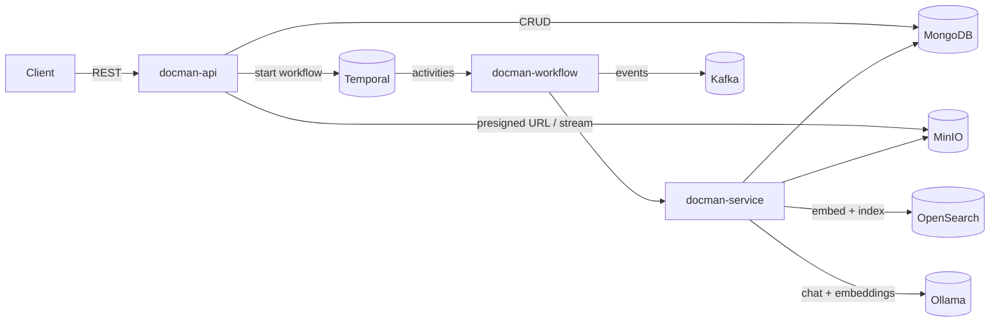
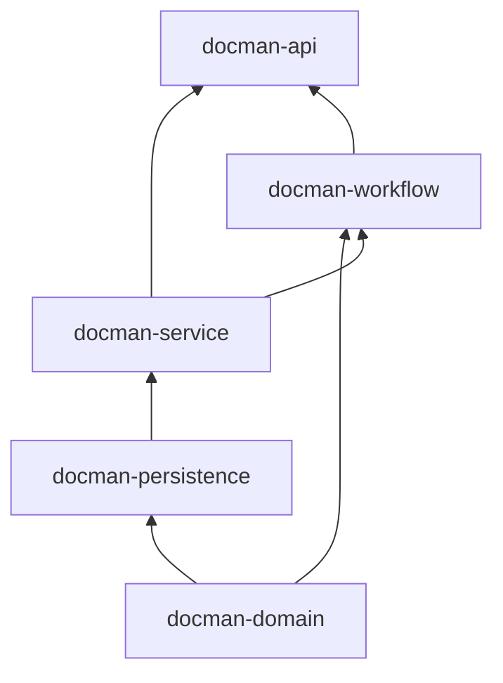
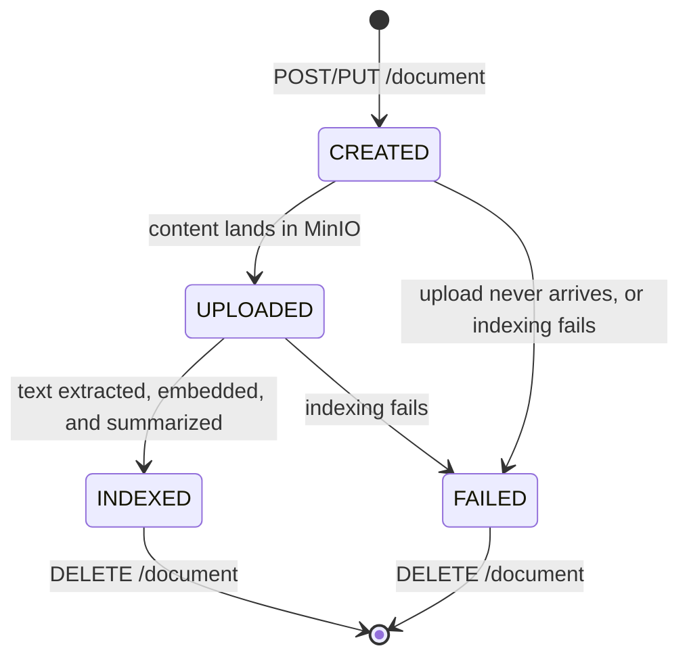
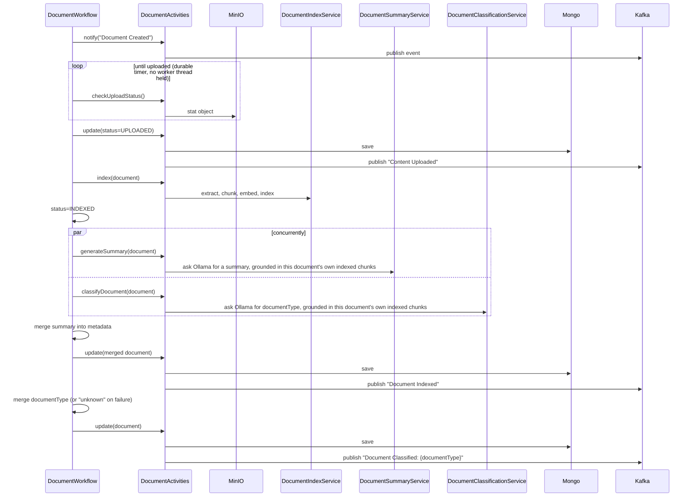

# Architecture & Tech Stack

## Overview

Docman AI ingests documents, extracts and indexes their content for retrieval, and answers
questions about them. The core design principle is that **ingestion is asynchronous**: a client
upload only has to wait for a presigned URL or a fast content write — everything expensive (text
extraction, embedding, summarization) happens afterward in a Temporal workflow, off the request
path.

## Tech Stack

| Component            | Technology                       | Role                                                                 |
|-----------------------|-----------------------------------|-----------------------------------------------------------------------|
| API / bootstrap        | Spring Boot 3.5, Java 21          | REST layer, application wiring, configuration                        |
| Object storage          | MinIO                             | Raw document bytes, accessed via presigned or server-mediated uploads |
| Metadata store           | MongoDB (Spring Data MongoDB)      | `Document` records (id, name, content type, status, document type, metadata, audit fields, version) plus a `document_revisions` collection tracking every past version's snapshot |
| Vector store              | OpenSearch                        | Chunk embeddings + per-chunk metadata for RAG and structured search   |
| Workflow orchestration     | Temporal                          | Durable, retryable ingestion pipeline                                |
| Eventing                   | Kafka                             | Lifecycle notifications for every ingestion stage, plus a metadata-sync trigger topic |
| Text extraction              | Apache Tika (via Spring AI)        | Extracts text from PDF/DOC/TXT/etc.                                  |
| Embeddings                    | Ollama `nomic-embed-text`          | 768-dimension vectors for chunked document text                      |
| Chat / RAG answers                | Ollama `llama3.1`                  | Answers questions grounded in indexed document content               |
| Document summarization            | Ollama `llama3.1` + OpenSearch      | Generates a 2-3 sentence summary via retrieval over the document's own indexed chunks |
| Document classification         | Ollama `llama3.1` (temperature `0`) + OpenSearch | Assigns `documentType` from a fixed category set, via retrieval over the document's own indexed chunks |
| DTO ↔ entity mapping              | MapStruct                          | Generates the `Document` ⇄ `DocumentDto`/`DocumentRequest` mappers at compile time |

## Module Structure

The project is a 5-module Maven reactor. Modules depend on each other in this order (each arrow
is a compile-time Maven dependency):

| Module                | Contents                                                                                   |
|-------------------------|-----------------------------------------------------------------------------------------------|
| **docman-domain**        | The `Document` entity (Mongo-mapped, now with `createdAt`/`createdBy`/`updatedAt`/`updatedBy`/`version`), `DocumentRevision` (a per-version snapshot), `DocumentStatus`, `DocumentType` (the fixed classification category set), all DTOs (`DocumentDto`, `DocumentRequest`, `DocumentUpdateRequest`, `DocumentResponse`, `DocumentSearchRequest`, `DocumentSearchResponse`), `QueryConstants`, and the MapStruct `DocumentMapper` |
| **docman-persistence**    | `DocumentMetadataRepository` and `DocumentRevisionRepository` — the Spring Data MongoDB repositories for `Document` and `DocumentRevision`      |
| **docman-service**        | Service interfaces *and* implementations: `DocumentService` (create/update, version bumps + revision snapshots, also publishes the metadata-sync Kafka trigger), `ObjectStoreService` (version-scoped MinIO keys), `DocumentIndexService` (Tika + embeddings + OpenSearch; also the metadata-only vector store sync), `DocumentSearchService` (RAG + lexical search), `DocumentSummaryService` (RAG-based summarization over the vector store), `DocumentClassificationService` (RAG-based `documentType` classification over the vector store) |
| **docman-workflow**        | The Temporal `DocumentWorkflow`/`DocumentActivities` definitions and implementations, and `DocumentWorkflowManager`, which starts/terminates a **version-scoped** workflow execution per document version |
| **docman-api**              | The runnable Spring Boot application: `Application` (entry point), `DocumentController` (REST, including the update API and version-aware GETs), exception handling, Kafka/MinIO/executor configuration, `DocumentIndexSyncConsumer` (the metadata-sync Kafka listener) |

Only **docman-api** produces an executable artifact (a Spring Boot fat jar via
`spring-boot-maven-plugin`); the other four build plain library jars.

Note that `Document` (the Mongo entity, in `docman-domain`) never crosses the REST boundary —
the controller and all service-layer method signatures use `DocumentDto` instead. The only place
`Document` and `DocumentDto` cross paths is `DocumentMapper`, and the Temporal activity layer
(`DocumentActivitiesImpl`), which is the boundary between Temporal's serialized workflow state
(`Document`) and the DTO-based service layer.

## Document Lifecycle

A `Document` moves through these statuses (`DocumentStatus`):

`UPDATED` also exists on the enum as a generic "metadata was updated" status, used by the shared
`update()` service method independent of the ingestion pipeline.

`status` and `version` are independent axes: `status` tracks where the *current* version is in
the ingestion pipeline; `version` is a monotonically increasing counter that only moves on
user-driven changes (a new file, or a metadata update via `PUT /document/{id}`) — see
[Document Versioning & Revision History](#document-versioning--revision-history). A new file
version resets `status` back to `CREATED` and re-enters this same state machine.

## Ingestion Workflow

`DocumentWorkflowManager.createWorkflow` starts one `DocumentWorkflow` execution per document
**version**, using a **deterministic workflow ID** (`doc-wf-{documentId}-v{version}`) — this lets
`DELETE /document/{id}` look up and terminate the current version's workflow without needing to
store the workflow ID anywhere, and lets a new file version start its own independent execution
(under a new ID) rather than depending on the previous version's run having already closed.

Key design points:

- **The upload wait is a durable timer, not a blocking activity.** `checkUploadStatus` does a
  single, fast MinIO `stat` call; the workflow itself sleeps (`Workflow.sleep`) between polls.
  This means an abandoned or slow upload doesn't tie up a Temporal worker thread — only the brief
  moment of each poll does. The workflow gives up after 15 minutes (`MAX_UPLOAD_WAIT`) if content
  never arrives, and the document ends up `FAILED`.
- **Summarization and classification both run only after indexing completes**, since both query
  the chunks indexing just wrote to the vector store rather than re-reading raw content from
  MinIO — see [Document Summarization & Classification](#document-summarization--classification).
  They run concurrently with *each other*, but neither can start until indexing has finished.
- **A failed summary or classification never fails the document.** Both get their own activity
  stub with a 10-minute timeout and a single attempt (retrying a slow-but-correct LLM call wastes
  time for no benefit); if either throws, the workflow logs it and continues (classification falls
  back to `unknown`) — the document still reaches `INDEXED`. A failed *index* step, by contrast,
  still fails the whole document (index/embed/search is the core capability; summarization and
  classification are supplementary).
- **Every step publishes a Kafka event** (`documents` topic) so external systems can observe
  ingestion progress without polling the API.

## Document Versioning & Revision History

Every `Document` carries `createdAt`/`createdBy` (set once, at creation) and
`updatedAt`/`updatedBy` (touched only by user-driven changes) alongside a `version` counter that
starts at `1` and increments exactly when a `POST`/`PUT /document/{id}` update includes a new
file, or changes metadata/documentType without one. Internal system saves — the workflow's own
status transitions, summary merge, and classification merge, all still going through the original
`DocumentService.update(DocumentDto)` — deliberately leave `version`/`updatedAt`/`updatedBy`
untouched, so the version count reflects user intent only, not every write the pipeline happens
to make along the way.

Every version bump (`DocumentServiceImpl.updateDocument`) also writes a `DocumentRevision`
snapshot to the `document_revisions` collection — `documentId`, `version`, `name`, `contentType`,
`documentType`, `metadata`, `updatedAt`, `updatedBy`, and whether this version included a new
file. `create()` writes a version-1 revision too, so history is complete from the start.
`GET /document/metadata/{id}/{version}` reads directly from this collection instead of the live
`Document` (a revision has no `status` — that's a live-workflow concept, not part of a version
snapshot).

Updates come in the same two flavors as creation does, mirroring `POST`/`PUT /document`:

- **`PUT /document/{id}`** (multipart: a `metadata` part shaped like `DocumentUpdateRequest`, plus
  an optional `file` part) handles both cases directly:
  - **Metadata-only** (`documentType`/`metadata`/`updatedBy`, no file): bumps `version`, replaces
    the metadata map outright rather than merging it (an update that omits a key drops it,
    including system-added ones like `summary`, unless the caller re-supplies it — see
    [`docs/API.md`](API.md) for the confirmed rationale), and triggers the existing
    [metadata-sync](#keeping-vector-store-metadata-in-sync) Kafka event so the change reaches the
    vector store without a reindex.
  - **Metadata + file**: same version bump, plus a `name`/`contentType` change and `status`
    resetting to `CREATED`. The controller calls `DocumentIndexService.deleteIndex` to clear the
    *previous* version's chunks first — indexing always assigns fresh chunk IDs, so without this
    step old and new versions' chunks would both remain and pollute search/RAG — uploads the new
    content, then starts a new workflow execution for this version: the exact same ingestion
    pipeline as initial creation (index, summarize, classify). The metadata-sync trigger is
    deliberately skipped for this case: syncing now would be redundant (the new version's own
    indexing is about to write fresh metadata anyway), and testing showed it can race the
    concurrent `deleteIndex` call and fail with an OpenSearch version conflict on the same chunk.
- **`POST /document/{id}`** is the presigned-upload counterpart, for when a new file version is
  intended but the caller wants to upload it directly to MinIO rather than through this API (large
  files, browser clients, etc.) — same version bump, metadata replacement, `deleteIndex` cleanup,
  and new workflow execution as the file case above, but it returns a presigned **PUT** URL instead
  of accepting the bytes, and the new workflow's upload-wait step picks up the content once the
  client uploads it (exactly like `POST /document` on creation). Since the presigned URL needs the
  new object key upfront, this endpoint always requires `name`/`contentType` in the request body —
  unlike `PUT /document/{id}`, it has no metadata-only mode.

**Concurrency guard**: `updateDocument` uses an optimistic-concurrency compare-and-swap rather
than a plain read-modify-write. It reads the current `Document`, then applies the change via
`MongoTemplate.findAndModify` with a query matching both `_id` *and* `version` equal to what was
just read, atomically setting the new fields (including `version + 1`) only if that match still
holds. If another request already won the race and bumped the version in between, the conditional
update matches nothing, `findAndModify` returns `null`, and the loser gets a
`DocumentConflictException` (`409 Conflict`) instead of silently overwriting or losing the winner's
change — verified under load by firing a burst of concurrent updates at the same document: exactly
one succeeds per contended version, the rest cleanly 409, and the revision history has no
duplicate or corrupted entries. This is deliberately different from the version field itself, which
is a plain int (not Spring Data's `@Version` optimistic-locking annotation, since that would bump
on every save including internal system ones) — the concurrency check here is a manual condition
on the same field, applied only in this one code path.

MinIO objects are stored per version — `{documentId}/{version}/{name}` — so every version's file
remains independently retrievable; `ObjectStoreServiceImpl` builds this key from
`DocumentDto.getVersion()` for every operation. A full `DELETE /document/{id}` removes every
version's object (a MinIO prefix list + bulk delete under `{documentId}/`), not just the current
one, along with all of that document's `DocumentRevision`s.

`GET /document/metadata/{id}` and `GET /document/content/{id}` both accept an optional trailing
`/{version}` segment to look up a specific past version instead of the latest. A content lookup
for a specific version also checks MinIO object existence first and 404s if that version never
had a file uploaded (e.g. a metadata-only revision) — the "latest" path doesn't do this extra
check, matching its existing behavior.

## Document Summarization & Classification

Once indexing completes, two independent AI steps run concurrently, both grounded in the chunks
indexing just wrote to the OpenSearch vector store rather than re-fetching the raw file from MinIO
and re-running Tika a second time:

- **`DocumentSummaryServiceImpl`** retrieves this document's own chunks (a `parent_document_id`
  filter, the same metadata key `DocumentIndexService.deleteIndex` uses to clean them up, with a
  generous `topK` so the filter — not similarity ranking — is what bounds the result set), sorts
  them back into original reading order using their `chunk_index` metadata (vector search returns
  chunks in similarity order, not document order), reassembles the text, and asks `llama3.1` for a
  2-3 sentence summary. If no chunks come back (e.g. the file had no extractable text), it returns
  `null` and the workflow skips the summary rather than storing a hallucinated one.
- **`DocumentClassificationServiceImpl`** runs a `QuestionAnswerAdvisor`-based RAG query scoped the
  same way, asking `llama3.1` to pick exactly one of a fixed set of categories (`DocumentType`, in
  `docman-domain`): `statements`, `invoices`, `policy documents`, `compliance certificates`,
  `insurance documents`, `contracts` — or `unknown` if the document doesn't clearly match any of
  them (also the fallback if the model's response doesn't match a known label, or if the activity
  throws). It runs at `temperature 0` (unlike the `1` used for RAG answers and summaries, configured
  via `spring.ai.ollama.chat.options.temperature` in `application.yaml`) via a per-call
  `OllamaChatOptions` override passed directly in code, so the same document consistently gets the
  same category — a single-word classification otherwise drifts between similar categories (e.g.
  "invoices" vs. "statements") on repeated runs of identical content at the app's configured
  temperature of `1`.

**Both retry briefly instead of forcing a refresh.** OpenSearch's default near-real-time refresh
means newly-added chunks aren't guaranteed searchable the instant `vectorStore.add()` returns —
there can be up to a second (or more, under load) before a background refresh cycle makes them
visible. Indexing deliberately does *not* force a synchronous refresh after adding chunks: at the
ingestion rates this app is meant to handle (tens of documents/second), that would turn every single
document into its own Lucene segment flush instead of letting writes batch into the normal refresh
cycle — trading a small, bounded per-document wait for a much larger, sustained indexing-throughput
cost. Instead, `VectorStoreConsistency.awaitChunks()` (`docman-service`) wraps the query both AI
steps make with a short bounded retry (up to 5 attempts, 300ms apart — so at most ~1.2s), which
comfortably covers the default refresh interval. Classification does a cheap `topK(1)` existence
check with this retry before running its (expensive) LLM call, so a document with genuinely no
extractable text short-circuits straight to `unknown` instead of asking the model to classify
nothing; summarization's own retrieval reuses the same helper directly.

Once a category is decided, the workflow persists `documentType` on the `Document` record and
publishes a `Document Classified: {documentType}` Kafka event — separate from the `Document
Indexed` event, since classification finishes independently of the summary merge.

Persisting `documentType` (like every other `DocumentService.update()` call) also triggers the
vector store metadata sync described below, so the chunk metadata written at indexing time — which
predates both the summary and the classification result — ends up reflecting them shortly after.

## Keeping Vector Store Metadata in Sync

Indexing captures `metadata`/`documentType` once, at indexing time. Everything that changes a
`Document` afterward — the summary and classification merges above, or any future direct metadata
edit — goes through the single `DocumentServiceImpl.update()` method, which now publishes the
document's id to the `document-metadata-sync` Kafka topic right after saving to Mongo.
`DocumentIndexSyncConsumer` (`docman-api`) consumes that topic, re-fetches the current `DocumentDto`
(rather than trusting the message payload, which could be stale by the time it's processed), and
calls `DocumentIndexService.updateMetadata()`, which runs an OpenSearch `update_by_query` scoped to
this document's chunks (the same `parent_document_id` filter used elsewhere) with a small Painless
script that merges each key from the current Mongo `metadata`/`documentType` into the chunk's
existing `metadata` object — key-by-key, not a wholesale replace, so chunk-only fields
(`parent_document_id`, `chunk_index`, `total_chunks`) survive untouched. Like indexing, this
deliberately does not force a refresh — this runs off a Kafka consumer with nothing synchronously
waiting on it, so there's no reason to pay for an immediate segment flush per update at whatever
rate they arrive; it becomes visible on the next natural refresh cycle instead.

This is deliberately a metadata-only patch, not a reindex: it never touches `embedding` or
`content`, so it doesn't re-run Tika, MinIO, or the embedding model. A few consequences worth
knowing:

- It's a **merge, not a diff** — removing a key from the Mongo `metadata` map doesn't remove it from
  the chunk (only additions/overwrites propagate). Full deletion-aware sync would need to compare
  old vs. new metadata, which isn't implemented.
- It's **eventually consistent, not synchronous** — `POST /document/search` may briefly still return
  the pre-update value for a `documentType`/metadata filter until the Kafka message is consumed
  (typically milliseconds to a couple of seconds locally). `GET /document/metadata/{id}` (reading
  straight from Mongo) is always current.
- It runs on **every** `update()` call, including the very first one (`UPLOADED` status, before
  indexing has written anything) — `update_by_query` simply matches zero chunks in that case, which
  is a harmless no-op logged at `info` level (`Synced metadata into 0 indexed chunk(s)...`).

## Search & RAG

Two independent search paths exist over the same OpenSearch index (`docman-vector-index`):

- **`POST /document/ask`** — vector similarity search + RAG. The question is embedded, the most
  relevant chunks are retrieved from OpenSearch, and `llama3.1` generates an answer grounded in
  that context (`QuestionAnswerAdvisor`). Runs on a bounded background executor
  (`askExecutor`, separate from Tomcat's request threads) since Ollama inference can take minutes
  on CPU-only hardware — the HTTP request uses Spring MVC's `DeferredResult` so the calling thread
  isn't blocked for the duration.
- **`POST /document/search`** — structured metadata search. Callers supply a map of field → value
  filters (e.g. `{"documentType": "invoice"}`); the server builds an OpenSearch `bool`/`match`
  query, prefixing every key with `metadata.` server-side. This means callers can never reach
  fields outside the `metadata` subtree (like raw `content` or the `embedding` vector) no matter
  what key they supply — the query is built from a fixed field-path template, not from arbitrary
  client-supplied query syntax.

Each indexed chunk's metadata includes the caller-supplied `metadata` map, plus two fields the
system adds automatically: `parent_document_id` (used to collapse/dedupe multiple chunks from the
same document in search results) and `documentType`, kept up to date by the [vector store metadata
sync](#keeping-vector-store-metadata-in-sync) described above.

## Presigned URLs

`POST /document` returns a MinIO presigned **PUT** URL — the client uploads content directly to
object storage, and the workflow's upload-wait step picks it up once it lands. `POST
/document/{id}` does the same for a new version of an existing document. `GET
/document/content` returns a presigned **GET** URL for downloading. All are genuinely
method-locked (the signature only validates for its intended HTTP method) and expire independently
(`minio.presigned.upload-url-expiry` / `download-url-expiry`, see
[`docs/SETUP.md`](SETUP.md#configuration-reference)).

`PUT /document` is the alternative, synchronous path: the client sends the file directly in the
request body (multipart), and the server streams it straight to MinIO without buffering the whole
file in memory.

Every object key includes the document's version — `{documentId}/{version}/{name}` — see
[Document Versioning & Revision History](#document-versioning--revision-history).

## Error Handling

`DocmanExceptionHandler` (`docman-api`) maps exceptions to a consistent
[`ProblemDetail`](https://datatracker.ietf.org/doc/html/rfc7873) JSON body for every error path:

| Exception                     | HTTP status |
|---------------------------------|-------------|
| `DocumentNotFoundException`      | 404         |
| `DocmanException`                | 400         |
| Any other unhandled exception     | 500         |

See [`docs/API.md`](API.md) for the exact error body shape and per-endpoint status codes.
